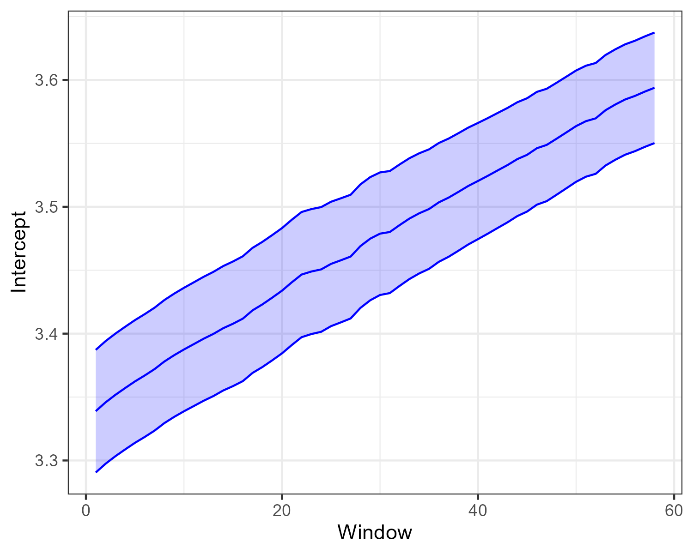
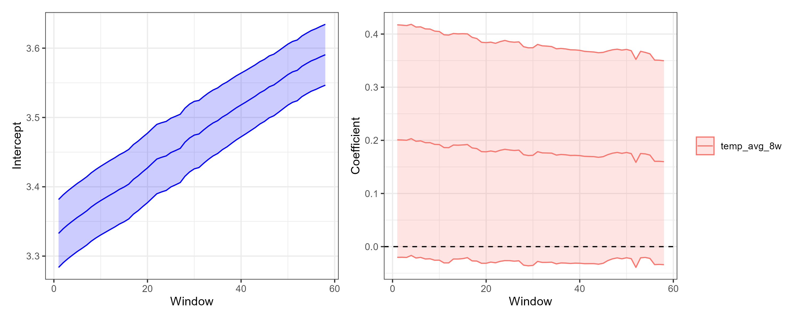
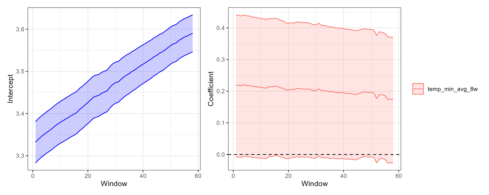
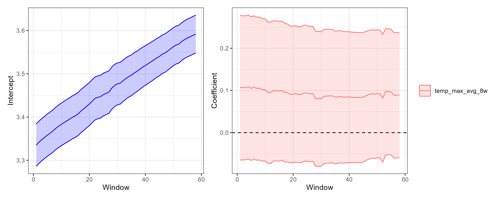
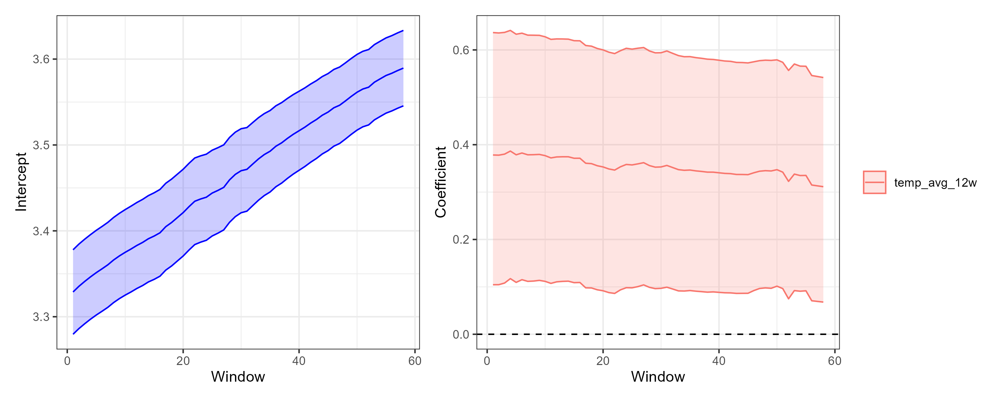
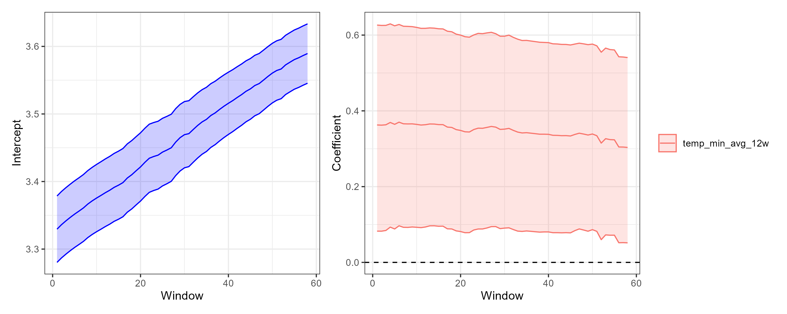
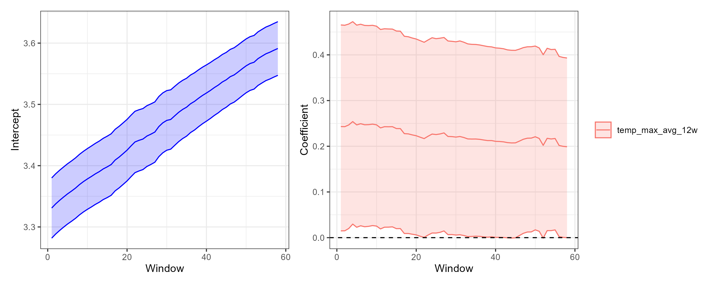
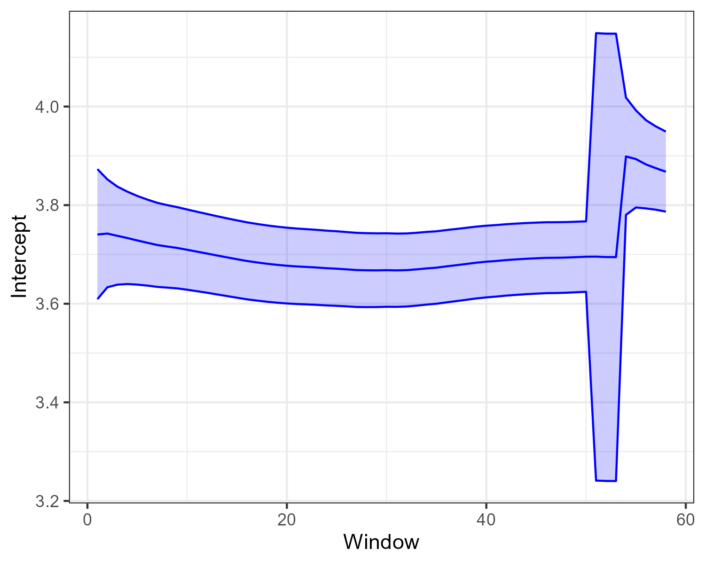

```{r setup, include = FALSE}
library(tidyverse)
library(ggplot2)
library(corrplot)
knitr::opts_chunk$set(
  collapse = TRUE
)
dengue_climate_joinville <- read_csv(here::here("data", "joinville", "dengue_climate_joinville_inla.csv"))

plots_pred_M0 <- readRDS(here::here("results", "joinville", "plots_pred_M0.rds"))
plots_pred_M1 <- readRDS(here::here("results", "joinville", "plots_pred_M1.rds"))
plots_pred_M2 <- readRDS(here::here("results", "joinville", "plots_pred_M2.rds"))
plots_pred_M3 <- readRDS(here::here("results", "joinville", "plots_pred_M3.rds"))
plots_pred_M4 <- readRDS(here::here("results", "joinville", "plots_pred_M4.rds"))
plots_pred_M5 <- readRDS(here::here("results", "joinville", "plots_pred_M5.rds"))
plots_pred_M6 <- readRDS(here::here("results", "joinville", "plots_pred_M6.rds"))
plots_pred_M7 <- readRDS(here::here("results", "joinville", "plots_pred_M7.rds"))
plots_pred_M8 <- readRDS(here::here("results", "joinville", "plots_pred_M8.rds"))

plots_time_effect_M0 <- readRDS(here::here("results", "joinville", "plots_time_effect_M0.rds"))
plots_time_effect_M1 <- readRDS(here::here("results", "joinville", "plots_time_effect_M1.rds"))
plots_time_effect_M2 <- readRDS(here::here("results", "joinville", "plots_time_effect_M2.rds"))
plots_time_effect_M3 <- readRDS(here::here("results", "joinville", "plots_time_effect_M3.rds"))
plots_time_effect_M4 <- readRDS(here::here("results", "joinville", "plots_time_effect_M4.rds"))
plots_time_effect_M5 <- readRDS(here::here("results", "joinville", "plots_time_effect_M5.rds"))
plots_time_effect_M6 <- readRDS(here::here("results", "joinville", "plots_time_effect_M6.rds"))

plots_week_effect_M0 <- readRDS(here::here("results", "joinville", "plots_week_effect_M0.rds"))
plots_week_effect_M1 <- readRDS(here::here("results", "joinville", "plots_week_effect_M1.rds"))
plots_week_effect_M2 <- readRDS(here::here("results", "joinville", "plots_week_effect_M2.rds"))
plots_week_effect_M3 <- readRDS(here::here("results", "joinville", "plots_week_effect_M3.rds"))
plots_week_effect_M4 <- readRDS(here::here("results", "joinville", "plots_week_effect_M4.rds"))
plots_week_effect_M5 <- readRDS(here::here("results", "joinville", "plots_week_effect_M5.rds"))
plots_week_effect_M6 <- readRDS(here::here("results", "joinville", "plots_week_effect_M6.rds"))
plots_week_effect_M7 <- readRDS(here::here("results", "joinville", "plots_week_effect_M7.rds"))

plots_year_effect_M7 <- readRDS(here::here("results", "joinville", "plots_year_effect_M7.rds"))
```

# Exploratory Data Analysis

## Time Series of Dengue Cases
```{r eda_dengue, echo = TRUE, fig.width=14, fig.height=6}
ggplot(dengue_climate_joinville, aes(x = data_iniSE)) +
  geom_line(aes(y = casprov), color = "red") +
  geom_line(aes(y = casos), color = "blue") +
  labs(title = "", x = "Epidemiological Week", y = "Number of Cases") + 
  scale_x_date(date_labels = "%Y-W%V", date_breaks = "1 month") +
  theme_minimal() +
  theme(axis.text.x = element_text(angle = 45, hjust = 1),
        legend.title = element_blank(),
        legend.position = "top")
```

## Time Series of Temperature
```{r time_series_temp, echo = TRUE, fig.width=14, fig.height=6}
ggplot(dengue_climate_joinville, aes(x = data_iniSE)) +
  geom_line(aes(y = temp_med_avg)) +
  labs(title = "", x = "Epidemiological Week", y = "Average Temperature (°C)") +
  scale_x_date(date_labels = "%Y-W%V", date_breaks = "1 month") +
  theme_minimal() +
  theme(axis.text.x = element_text(angle = 45, hjust = 1),
        legend.title = element_blank(),
        )
```

## Time Series of Average temperature in the previous week

```{r time_series_temp_8w, echo = TRUE, fig.width=14, fig.height=6}
ggplot(dengue_climate_joinville, aes(x = data_iniSE)) +
  geom_line(aes(y = temp_avg_8w)) +
  labs(title = "", x = "Epidemiological Week", y = "Average Temperature in the Previous 8 Weeks (°C)") +
  scale_x_date(date_labels = "%Y-W%V", date_breaks = "1 month") +
  theme_minimal() +
  theme(axis.text.x = element_text(angle = 45, hjust = 1),
        legend.title = element_blank(),
        )
```

```{r time_series_temp_min_8w, echo = TRUE, fig.width=14, fig.height=6}
ggplot(dengue_climate_joinville, aes(x = data_iniSE)) +
  geom_line(aes(y = temp_min_avg_8w)) +
  labs(title = "", x = "Epidemiological Week", y = "Average Minimum Temperature in the Previous 8 Weeks (°C)") +
  scale_x_date(date_labels = "%Y-W%V", date_breaks = "1 month") +
  theme_minimal() +
  theme(axis.text.x = element_text(angle = 45, hjust = 1),
        legend.title = element_blank(),
        )
```

```{r time_series_temp_max_8w, echo = TRUE, fig.width=14, fig.height=6}
ggplot(dengue_climate_joinville, aes(x = data_iniSE)) +
  geom_line(aes(y = temp_max_avg_8w)) +
  labs(title = "", x = "Epidemiological Week", y = "Average Maximum Temperature in the Previous 8 Weeks (°C)") +
  scale_x_date(date_labels = "%Y-W%V", date_breaks = "1 month") +
  theme_minimal() +
  theme(axis.text.x = element_text(angle = 45, hjust = 1),
        legend.title = element_blank(),
        )
```

```{r time_series_temp_12w, echo = TRUE, fig.width=14, fig.height=6}
ggplot(dengue_climate_joinville, aes(x = data_iniSE)) +
  geom_line(aes(y = temp_avg_12w)) +
  labs(title = "", x = "Epidemiological Week", y = "Average Temperature in the Previous 12 Weeks (°C)") +
  scale_x_date(date_labels = "%Y-W%V", date_breaks = "1 month") +
  theme_minimal() +
  theme(axis.text.x = element_text(angle = 45, hjust = 1),
        legend.title = element_blank(),
        )
``` 

```{r time_series_temp_min_12w, echo = TRUE, fig.width=14, fig.height=6}
ggplot(dengue_climate_joinville, aes(x = data_iniSE)) +
  geom_line(aes(y = temp_min_avg_12w)) +
  labs(title = "", x = "Epidemiological Week", y = "Average Minimum Temperature in the Previous 12 Weeks (°C)") +
  scale_x_date(date_labels = "%Y-W%V", date_breaks = "1 month") +
  theme_minimal() +
  theme(axis.text.x = element_text(angle = 45, hjust = 1),
        legend.title = element_blank(),
        )
```

```{r time_series_temp_max_12w, echo = TRUE, fig.width=14, fig.height=6}
ggplot(dengue_climate_joinville, aes(x = data_iniSE)) +
  geom_line(aes(y = temp_max_avg_12w)) +
  labs(title = "", x = "Epidemiological Week", y = "Average Maximum Temperature in the Previous 12 Weeks (°C)") +
  scale_x_date(date_labels = "%Y-W%V", date_breaks = "1 month") +
  theme_minimal() +
  theme(axis.text.x = element_text(angle = 45, hjust = 1),
        legend.title = element_blank(),
        )
```

# Correlation Analysis

```{r correlation_analysis, echo = TRUE, fig.width=14, fig.height=6}
# Select relevant columns for correlation analysis
correlation_data <- dengue_climate_joinville %>%
  select(casos, temp_med_avg, temp_avg_8w, temp_min_avg_8w, temp_max_avg_8w, temp_avg_12w, temp_min_avg_12w, temp_max_avg_12w)
# Calculate the correlation matrix
cor_matrix <- cor(correlation_data, use = "complete.obs")
# Visualize the correlation matrix
corrplot(cor_matrix, method = "color", type = "upper", tl.col = "black", tl.srt = 45)
```

# Fitted Models

- Initial period: 2015-W09 to 2025-W01
- From model 0 to model 7, for each response variable $Y_t$, we assume a Poisson distribution with mean $\lambda_t$ and log link function, and we include a random walk of order 1 in the time observations, with cyclic effect for the epidemiological week and an AR(1) structure for the year, as follows:

\begin{align*}
Y_t &\sim \text{Poisson}(\lambda_t), \\
\log(\lambda_t) &= \beta_0 + \beta_1 X_{t} + u_t + v_t(\text{week}_t, \text{year}_t) \\
u_t &\sim \text{RW1}(\sigma^2_u), \\
\end{align*}

where for a fixed year $y$, 
\begin{align*}
v_t(\text{week}_t, y) &\sim \text{RW1}(\sigma^2_w), \\
v_t(1, y) - v_t(52, y) &\sim \text{Normal}(0, \sigma^2_w),
\end{align*}
and for a fixed epidemiological week $w$,
\begin{align*}
v_t(w, \text{year}_t) &\sim \text{AR1}(\rho, \sigma^2_y).
\end{align*}

## Model 0: Baseline model with no covariates

- $X_t = 0$ for all $t$.

```{r model_0, echo = TRUE, fig.width=14, fig.height=6}
print(plots_pred_M0[[length(plots_pred_M0)]])
print(plots_time_effect_M0[[length(plots_time_effect_M0)]])
print(plots_week_effect_M0[[length(plots_week_effect_M0)]])
```



## Model 1: Average temperature in the previous 8 weeks

- $X_t = \text{temp\_avg\_8w}_t$.

```{r model_1, echo = TRUE, fig.width=14, fig.height=6}
print(plots_pred_M1[[length(plots_pred_M1)]])
print(plots_time_effect_M1[[length(plots_time_effect_M1)]])
print(plots_week_effect_M1[[length(plots_week_effect_M1)]])
```



## Model 2: Average minimum temperature in the previous 8 weeks

- $X_t = \text{temp\_min\_avg\_8w}_t$.
```{r model_2, echo = TRUE, fig.width=14, fig.height=6}
print(plots_pred_M2[[length(plots_pred_M2)]])
print(plots_time_effect_M2[[length(plots_time_effect_M2)]])
print(plots_week_effect_M2[[length(plots_week_effect_M2)]])
```



## Model 3: Average maximum temperature in the previous 8 weeks
- $X_t = \text{temp\_max\_avg\_8w}_t$.
```{r model_3, echo = TRUE, fig.width=14, fig.height=6}
print(plots_pred_M3[[length(plots_pred_M3)]])
print(plots_time_effect_M3[[length(plots_time_effect_M3)]])
print(plots_week_effect_M3[[length(plots_week_effect_M3)]])
```



## Model 4: Average temperature in the previous 12 weeks
- $X_t = \text{temp\_avg\_12w}_t$
```{r model_4, echo = TRUE, fig.width=14, fig.height=6}
print(plots_pred_M4[[length(plots_pred_M4)]])
print(plots_time_effect_M4[[length(plots_time_effect_M4)]])
print(plots_week_effect_M4[[length(plots_week_effect_M4)]])
```



## Model 5: Average minimum temperature in the previous 12 weeks
- $X_t = \text{temp\_min\_avg\_12w}_t$
```{r model_5, echo = TRUE, fig.width=14, fig.height=6}
print(plots_pred_M5[[length(plots_pred_M5)]])
print(plots_time_effect_M5[[length(plots_time_effect_M5)]])
print(plots_week_effect_M5[[length(plots_week_effect_M5)]])
```



## Model 6: Average maximum temperature in the previous 12 weeks
- $X_t = \text{temp\_max\_avg\_12w}_t$
```{r model_6, echo = TRUE, fig.width=14, fig.height=6}
print(plots_pred_M6[[length(plots_pred_M6)]])
print(plots_time_effect_M6[[length(plots_time_effect_M6)]])
print(plots_week_effect_M6[[length(plots_week_effect_M6)]])
```



## Model 7: Leo's model

\begin{align*}
Y_t &\sim \text{Neg-Bin}(\lambda_t, \theta), \\
\log(\lambda_t) &= \beta_0 + u_t(\text{week}_t) + v_t(\text{year}_t) \\
u_t &\sim \text{RW2}(\sigma^2_u), \\
v_t &\sim \text{Normal}(0, \sigma^2_v).
\end{align*}

```{r model_7, echo = TRUE, fig.width=14, fig.height=6}
print(plots_pred_M7[[length(plots_pred_M7)]])
print(plots_week_effect_M7[[length(plots_week_effect_M7)]])
print(plots_year_effect_M7[[length(plots_year_effect_M7)]])
```



# Model 8: AR(10)

- First step: transform the response variable by taking the logarithm of the observed cases plus one, i.e., $Y_t = \log(\text{casos}_t + 1)$.
- Second step: fit an AR(10) model to the transformed response variable, i.e.,
\begin{align*}
Y_t &= \alpha + \sum_{i=1}^{10} \phi_i Y_{t-i} + \epsilon_t, \\
\epsilon_t &\sim \text{Normal}(0, \sigma^2).
\end{align*}

```{r model_8, echo = TRUE, fig.width=14, fig.height=6}
print(plots_pred_M8[[length(plots_pred_M8)]])
```

# Model Comparison

```{r mae_id, echo = F, message = FALSE, warning = FALSE}
here::here("results", "joinville", "mae_by_id.csv") %>%
  read_csv() %>%
  knitr::kable(caption = "MAE by Model and Time Window", digits = 2)
```

```{r mae_by_window, echo = F, message = FALSE, warning = FALSE}
here::here("results", "joinville", "mae_by_window.csv") %>%
  read_csv() %>%
  knitr::kable(caption = "MAE by Time Window", digits = 2)
```

```{r summary_results, echo = F, message = FALSE, warning = FALSE}
summary_results <- read_csv(here::here("results", "joinville", "summary_metrics.csv"))
knitr::kable(summary_results, caption = "Model Comparison Results", digits = 2)
```