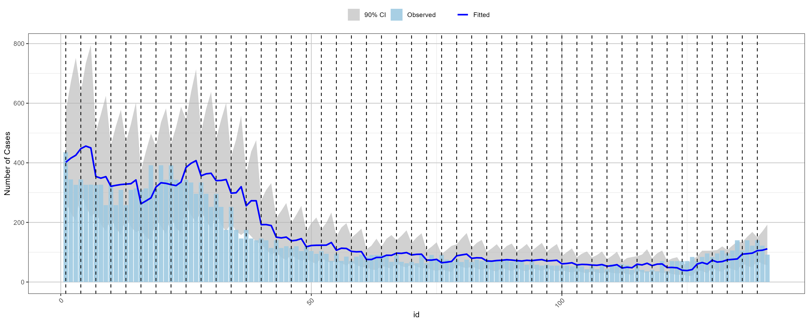
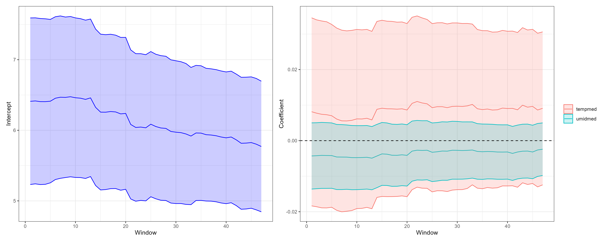
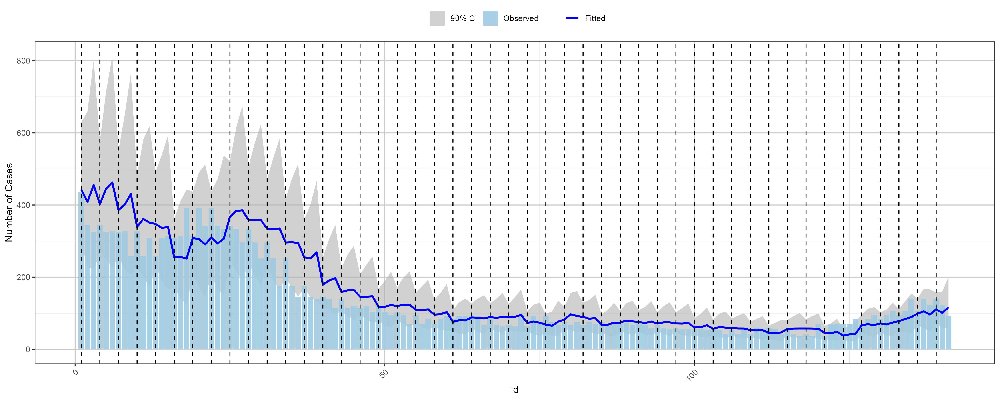
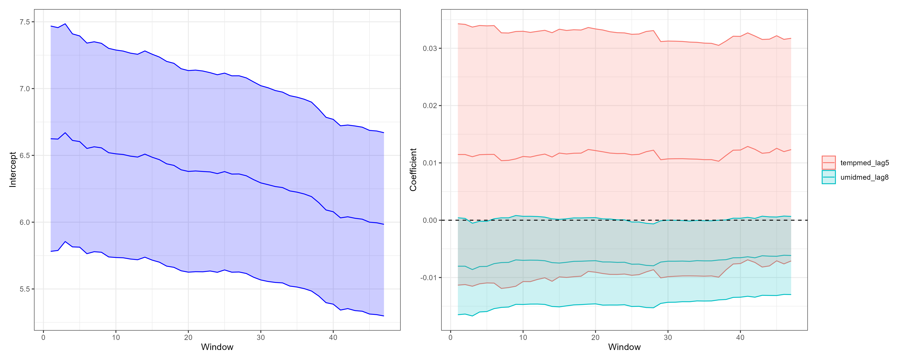

```{r setup, include = FALSE}
library(tidyverse)
library(ggplot2)
library(corrplot)
knitr::opts_chunk$set(
  collapse = TRUE
)
dengue_climate_rj <- read_csv("../../data/rio_de_janeiro/dengue_climate_rj_inla.csv")
```

# Exploratory Data Analysis

## Time Series of Dengue Cases
```{r eda_dengue, echo = TRUE}
ggplot() +
  geom_line(data = dengue_climate_rj, 
            aes(x = data_iniSE, y = casprov, color = "Probable Cases")) +
  geom_line(data = dengue_climate_rj, 
            aes(x = data_iniSE, y = casos, color = "Reported Cases")) +
  labs(title = "", x = "Epidemiological Week", y = "Number of Cases") + 
  scale_x_date(date_labels = "%Y-W%V", date_breaks = "1 month") +
  scale_color_manual(values = c("Reported Cases" = "blue",
                                "Probable Cases" = "red")) +
  theme_minimal() +
  theme(axis.text.x = element_text(angle = 45, hjust = 1),
        legend.title = element_blank(),
        legend.position = "top")
```

## Time Series of Temperature
```{r eda_temp, echo = TRUE}
ggplot(dengue_climate_rj, aes(x = data_iniSE)) +
  geom_line(aes(y = tempmed)) +
  labs(title = "", x = "Epidemiological Week", y = "Average Temperature (°C)") +
  scale_x_date(date_labels = "%Y-W%V", date_breaks = "1 month") +
  theme_minimal() +
  theme(axis.text.x = element_text(angle = 45, hjust = 1),
        legend.title = element_blank(),
        )
```

## Time Series of Humidity
```{r eda_humidity, echo = TRUE}
ggplot(dengue_climate_rj, aes(x = data_iniSE)) +
  geom_line(aes(y = umidmed)) +
  labs(title = "", x = "Epidemiological Week", y = "Average Humidity (%)") +
  scale_x_date(date_labels = "%Y-W%V", date_breaks = "1 month") +
  theme_minimal() +
  theme(axis.text.x = element_text(angle = 45, hjust = 1),
        legend.title = element_blank(),
        )
```

## Time Series of Precipitation
```{r eda_precip, echo = TRUE}
ggplot(dengue_climate_rj, aes(x = data_iniSE)) +
  geom_line(aes(y = precip_total)) +
  labs(title = "", x = "Epidemiological Week", y = "Total Precipitation (mm))") +
  scale_x_date(date_labels = "%Y-W%V", date_breaks = "1 month") +
  theme_minimal() +
  theme(axis.text.x = element_text(angle = 45, hjust = 1),
        legend.title = element_blank(),
        )
```

## Correlation Analysis
```{r eda_correlation, echo = TRUE}
cor_data <- dengue_climate_rj %>%
  select(tempmed, umidmed, precip_total) %>%
  drop_na()
cor_matrix <- cor(cor_data)
corrplot::corrplot(cor_matrix, method = "color")
```

## Autocorrelation Analysis
```{r eda_acf, echo = TRUE}
acf(dengue_climate_rj$casprov, main = "ACF of Dengue Cases")
acf(dengue_climate_rj$tempmed, main = "ACF of Average Temperature")
acf(dengue_climate_rj$umidmed, main = "ACF of Average Humidity")
acf(diff(dengue_climate_rj$casprov), main = "ACF of Differenced Dengue Cases")
acf(diff(dengue_climate_rj$tempmed), main = "ACF of Differenced Average Temperature")
```

## Lagged Correlation Analysis
```{r eda_ccf, echo = TRUE}
ccf_temp <- ccf(diff(dengue_climate_rj$casprov), diff(dengue_climate_rj$tempmed), lag.max = 12, main = "CCF between Differenced Dengue Cases and Differenced Temperature")
ccf_umid <- ccf(diff(dengue_climate_rj$casprov), dengue_climate_rj$umidmed, lag.max = 12, main = "CCF between Differenced Dengue Cases and Average Humidity")
ccf_precip <- ccf(diff(dengue_climate_rj$casprov), diff(dengue_climate_rj$precip_total), lag.max = 12, main = "CCF between Differenced Dengue Cases and Differenced Precipitation")
```

# Fitting Models

Initial period: 2023-W13 to 2025-W18

## Model 1

For each observed case $Y_i$, we assume a Poisson distribution with mean $\mu_i$:
$$Y_i \sim \text{Poi}(\mu_i).$$
The mean $\mu_i$ is modeled as a function of the covariates using a log link function:
$$
\begin{align*}
\log(\mu_i) &= \beta_0 + \beta_1 \cdot \text{tempmed}_i + \beta_2 \cdot \text{umidmed}_i + u_i, 
\\
u_i &\sim \text{RW1}(\sigma^2_u).
\end{align*}
$$





## Model 2

We change the model 1 by including lagged effects of the covariates:
$$
\begin{align*}
\log(\mu_i) &= \beta_0 + \beta_1 \cdot \text{tempmed}_{i-5} + \beta_3 \cdot \text{umidmed}_{i-8} + u_i,
\\
u_i &\sim \text{RW1}(\sigma^2_u).
\end{align*}
$$





## Model Comparison Results

```{r summary, echo = F, message = FALSE, warning = FALSE}
summary_results <- read_csv("../../results/rio_de_janeiro/summary_results.csv")
knitr::kable(summary_results, caption = "Model Comparison Results", digits = 2)
```
